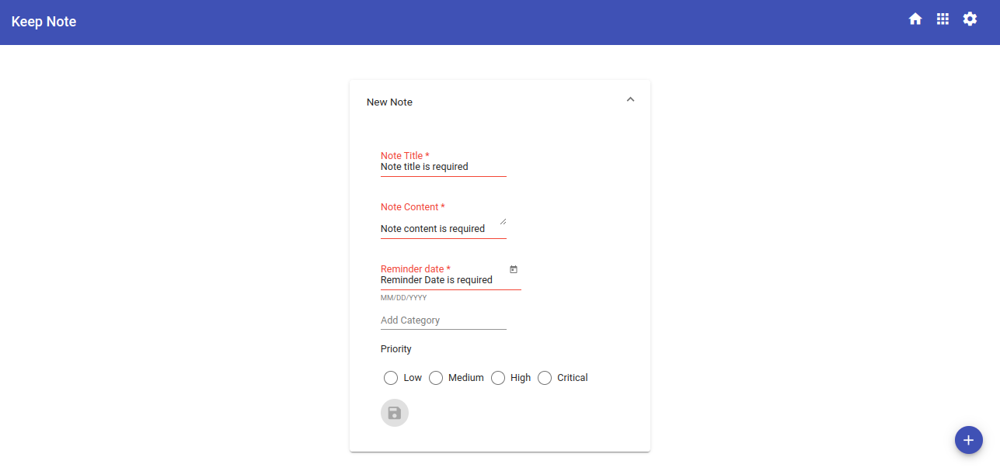
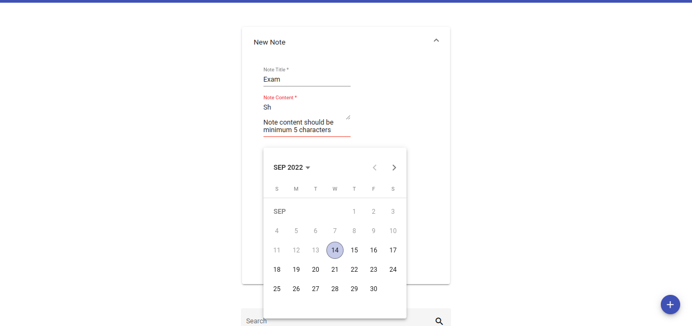
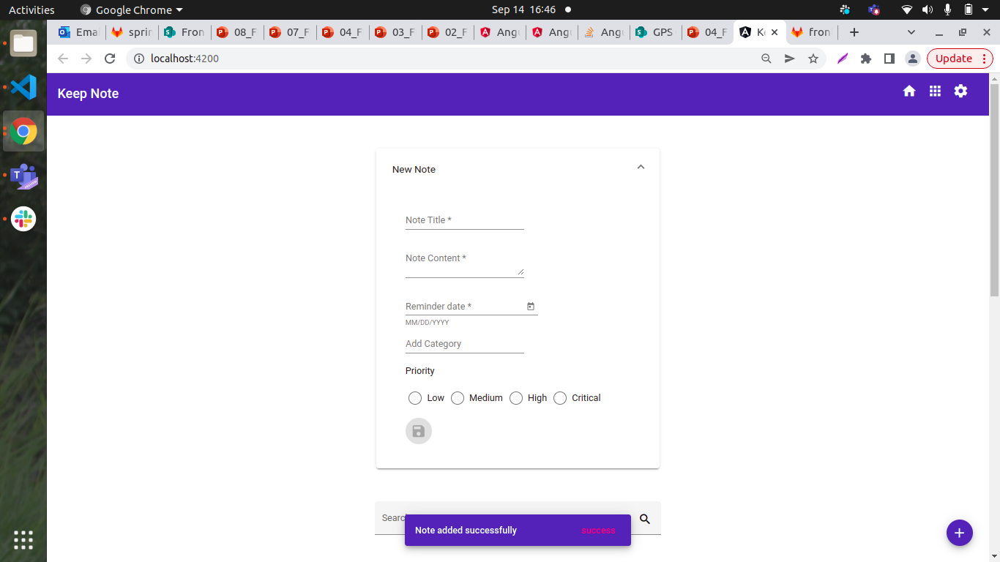
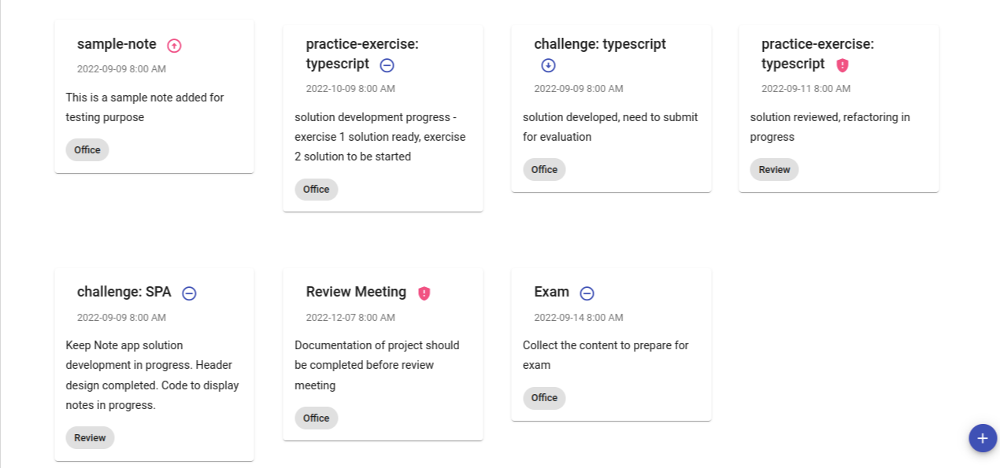

## Challenge - Develop a template driven form to add a note in Keep Note application

### Context

Keep Note is a web app that allows users to maintain notes. The app should be designed as a single-page application. ​

The app should be developed by creating components based on the SPA approach. ​

The phase 1,2 and 3 of development are completed. During these three phases, the components are created to add, view, and search notes. The persistence has been implemented, and notes are added and retrieved from the server. The components are styled using Angular material. ​

By making HTTP calls to json-server, notes are fetched from and saved in the `notes.json` file in the `keep-note-data` folder. ​

In phase 4, a template-driven form should be created for adding a new note which makes the form more user-friendly by providing visual feedbacks for validation errors.

## Problem Statement

Develop a template-driven form to add a new note. The data model for notes should include properties like title, content, reminder date, category, and priority level.

The template-driven form created should resemble the following images.

**Add Note Form**

**Add Note Form With Validation Errors**

**Add Note Form With More Validation Errors**

**Add Note Form WIth Valid Values**

**Successful Form Submission**

**Newly Added note in card**

#### Points To Remember
- In phase 4 development, the solution created for the Keep Note application in the previous sprint `Style a Single-Page Application Using Angular Material` must be used to enhance the add note form.​
- Template-driven form should be created to add a new note. The form input elements must be created using Angular material components​
- All the required modules to work with Angular forms and material components should be imported in the application root module.​
- Validations must be implemented for the form controls.​
- Newly added note should be available after successful form submission in the note list as seen in the expected output image.​
- Following mat-icons should be used for displaying the priority levels while adding the note in a card.

|Priority-level|mat-icon|
|-------------|---------|
|Critical|gpp_maybe|
|High|arrow_circle_up|
|Medium|remove_circle_outline|
|Low|arrow_circle_down|

